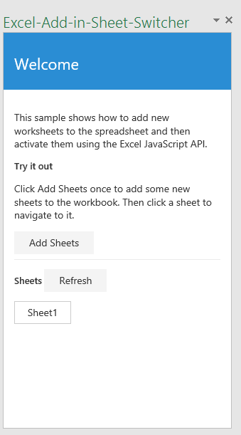

# Aufgabenbereich-Add-In-Beispiel für Arbeitsblattschnellzugriff für Excel 2016

_Gilt für: Excel 2016_

Mit diesem Aufgabenbereich-Add-In können Sie neue Arbeitsblätter zu einer Arbeitsmappe über den Aufgabebereich hinzufügen und in Excel 2016 zu den verschiedenen Arbeitsblättern navigieren. Es ist in zwei Versionen verfügbar: Text-Editor und Visual Studio.

## Probieren Sie es aus
### Text-Editor-Version

Am einfachsten können Sie Ihr Add-In bereitstellen und testen, indem Sie die Dateien in eine Netzwerkfreigabe kopieren.

1.  Erstellen Sie einen Ordner in einer Netzwerkfreigabe (z. B. \\\MyShare\SheetSwitcher), und kopieren Sie alle Dateien im Ordner „Text-Editor“. 
2.  Bearbeiten Sie das <SourceLocation>-Element der Manifestdatei, damit es auf den Freigabepfad aus Schritt 1 zeigt. 
3.  Kopieren Sie das Manifest (SheetSwitcherManifest.xml) in eine Netzwerkfreigabe (z. B. \\\MyShare\MyManifests).
4.  Fügen Sie den Freigabepfad, unter dem das Manifest enthalten ist, als vertrauenswürdigen App-Katalog in Excel hinzu.

    a. Starten Sie Excel, und �ffnen Sie ein leeres Arbeitsblatt.  
    
    b. Klicken Sie auf die Registerkarte **Datei**, und klicken Sie dann auf **Optionen**.
    
    c. Wühlen Sie **Trust Center** aus, und klicken Sie dann auf die Schaltflüche **Einstellungen für das Trust Center**.
    
  d. Wühlen Sie **Vertrauenswürdige App-Kataloge** aus.
    
  e. Geben Sie im Feld **Katalog-URL** den Pfad zu der in Schritt 1 erstellten Netzwerkfreigabe ein, und klicken Sie auf **Katalog hinzufügen**.
    
   f. Aktivieren Sie das Kontrollküstchen **Im Menü anzeigen**, und wühlen Sie dann **OK**. Eine Meldung wird angezeigt, dass Ihre Einstellungen angewendet werden, wenn Office das nüchste Mal gestartet wird. 
        
5.  Testen und führen Sie das Add-In aus. 

  a. Klicken Sie auf der Registerkarte **Einfügen** in Excelü2016 auf **Meine-Add-Ins**. 
    
  b. Wühlen Sie im Dialogfenster **Office-Add-Ins** die Option **Freigegebener Ordner** aus.
    
  c. Wühlen Sie **Arbeitsblatt-Schnellzugriff-Beispiel**>**Einfügen**. Das Add-In wird in einem Aufgabenbereich rechts neben dem aktuellen Arbeitsblatt geöffnet, wie in der folgenden Abbildung dargestellt. 
        

  d. Klicken Sie auf die Schaltflüche **Blütter hinzufügen**. .">Dabei werden vierzehn neue Arbeitsblätter zur Arbeitsmappe hinzugefügt. Klicken Sie auf die Blattschaltflächen im Aufgabebereich, um zum entsprechenden Arbeitsblatt in der Arbeitsmappe zu navigieren.
        

### Visual Studio-Version
1.  Kopieren Sie das Projekt in einen lokalen Ordner, und üffnen Sie die Datei Excel-Add-in-Sheet-Switcher.sln in Visual Studio.
2.  Drücken Sie F5, um das Beispiel-Add-In zu erstellen und bereitzustellen. Excel wird gestartet und das Add-In wird in einem Aufgabenbereich rechts neben einem leeren Arbeitsblatt geöffnet, wie in der folgenden Abbildung dargestellt. 
        

3. Klicken Sie auf die Schaltflüche **Blütter hinzufügen**. Dabei werden vierzehn neue Arbeitsblütter zur Arbeitsmappe hinzugefügt. Klicken Sie auf die Blattschaltflüchen im Aufgabebereich, um zum entsprechenden Arbeitsblatt in der Arbeitsmappe zu navigieren.

### Weitere Informationen

Die Excel-JavaScript-APIs haben viel mehr bei der Entwicklung von Add-Ins zu bieten. Im Folgenden werden nur einige der verfügbaren Ressourcen aufgeführt. 

1.  [Programmierungsübersicht für Excel-Add-Ins](https://github.com/OfficeDev/office-js-docs/blob/master/excel/excel-add-ins-programming-overview.md)
2.  [Codeausschnitt-Explorer für Excel](http://officesnippetexplorer.azurewebsites.net/#/snippets/excel)
3.  [Codebeispiele zu Excel-Add-Ins](https://github.com/OfficeDev/office-js-docs/blob/master/excel/excel-add-ins-code-samples.md) 
4.  [JavaScript-API-Referenz zu Excel-Add-Ins](https://github.com/OfficeDev/office-js-docs/blob/master/excel/excel-add-ins-javascript-reference.md)
5.  [Erstellen Ihres ersten Excel-Add-Ins](https://github.com/OfficeDev/office-js-docs/blob/master/excel/build-your-first-excel-add-in.md)
