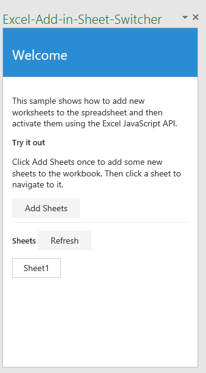

# Excel 2016 用のシート切り替えツール作業ウィンドウ アドインのサンプル

_適用対象:Excel 2016_

この作業ウィンドウ アドインでは、作業ウィンドウを使用して新しいシートをブックに追加し、Excel 2016 内の別のシートに簡単に移動する手段が提供されます。テキスト エディターと Visual Studio のいずれかを選択できます。

## お試しください。
### テキスト エディターのバージョン

アドインを展開してテストする最も簡単な方法は、ファイルをネットワーク共有にコピーすることです。

1.  テキスト エディターのフォルダー内のファイルをコピーし、任意のサーバーを使用してそれをホストします。
2.  マニフェスト ファイル (SheetSwitcherManifest.xml) の \<SourceLocation\> 要素と \<URL\> 要素を編集して、手順 1 のホストの場所 (たとえば https://localhost/SheetSwitcher/home.html) をポイントするようにします。
3.  マニフェスト (SheetSwitcherManifest.xml) をネットワーク共有 (たとえば \\\MyShare\SheetSwitcher) にコピーします。
4.  マニフェストを格納する共有の場所を、Excel で信頼されるアプリ カタログとして追加します。

    a.Excel を起動し、空のスプレッドシートを開きます。

    b.**[ファイル]** タブを選び、**[オプション]** を選びます。

    c.**[セキュリティ センター]** を選択し、**[セキュリティ センターの設定]** ボタンを選択します。

    d.**[信頼されているアプリ カタログ]** を選択します。

    e.**[カタログの URL]** ボックスに、手順 1 で作成したネットワーク共有のパスを入力し、**[カタログの追加]** を選択します。

   f. **[メニューに表示する]** チェック ボックスをオンにしてから **[OK]** を選択します。これらの設定は Office を次回起動したときに適用されることを示すメッセージが表示されます。

5.  アドインをテストし、実行します。

    a.Excel 2016 の **[挿入]** タブで、**[個人用アドイン]** を選択します。

    b.**[Office アドイン]** ダイアログ ボックスで、**[共有フォルダー]** を選択します。

    c.**[シート切り替えツールのサンプル]**>**[挿入]** の順に選択します。次の図に示すように、現在のワークシートの右側の作業ウィンドウでアドインが開きます。

  

    d.**[シートの追加]** ボタンをクリックします。この操作により、14 の新しいシートがスプレッドシートに追加されます。作業ウィンドウに表示されるシート ボタンのいずれかをクリックし、ブックのそのシートに移動します。

### Visual Studio のバージョン
1.  プロジェクトをローカル フォルダーにコピーし、Visual Studio で Excel-Add-in-Sheet-Switcher.sln を開きます。
2.  F5 キーを押して、サンプル アドインをビルドおよび展開します。Excel が起動し、次の図に示すように、空白のワークシートの右側の作業ウィンドウでアドインが開きます。

  

3. **[シートの追加]** ボタンをクリックします。この操作により、14 の新しいシートがスプレッドシートに追加されます。作業ウィンドウに表示されるシート ボタンのいずれかをクリックし、ブックのそのシートに移動します。

### 詳細を見る

アドインを開発する際に Excel JavaScript API でできることは他にも数多くあります。以下は、利用可能なリソースのほんの一例です。

1.  [Excel アドインのプログラミングの概要](https://github.com/OfficeDev/office-js-docs/blob/master/excel/excel-add-ins-programming-overview.md)
2.  [Excel のスニペット エクスプローラー](http://officesnippetexplorer.azurewebsites.net/#/snippets/excel)
3.  [Excel アドインのコード サンプル](https://github.com/OfficeDev/office-js-docs/blob/master/excel/excel-add-ins-code-samples.md)
4.  [Excel アドインの JavaScript API リファレンス](https://github.com/OfficeDev/office-js-docs/blob/master/excel/excel-add-ins-javascript-reference.md)
5.  [最初の Excel アドインをビルドする](https://github.com/OfficeDev/office-js-docs/blob/master/excel/build-your-first-excel-add-in.md)